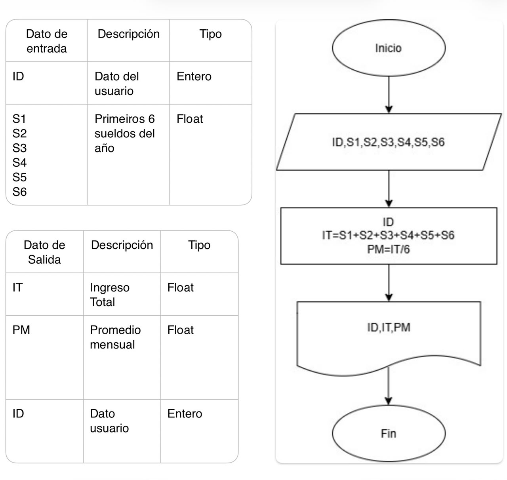
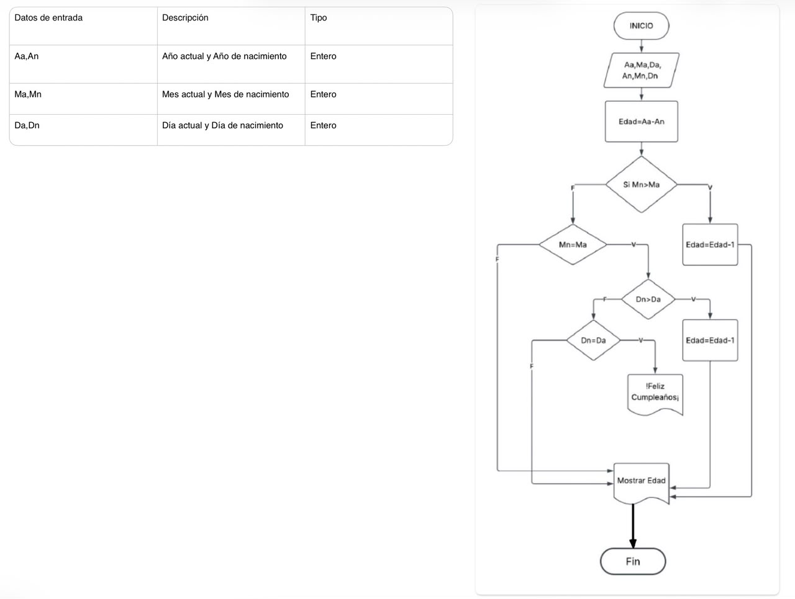
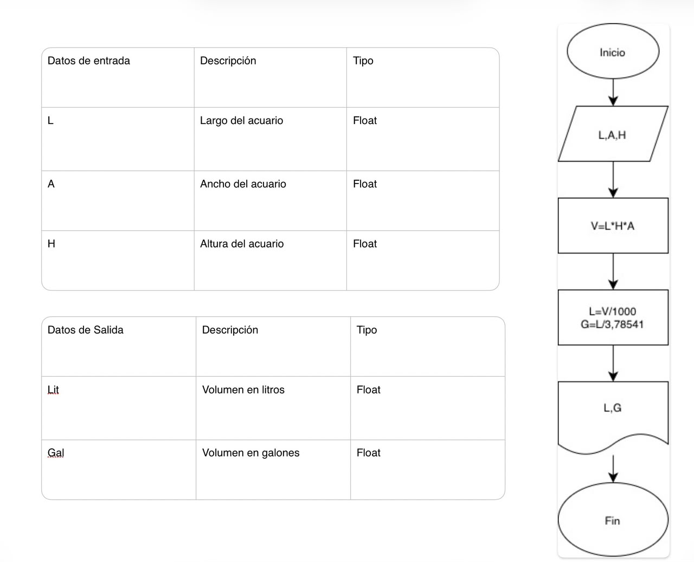
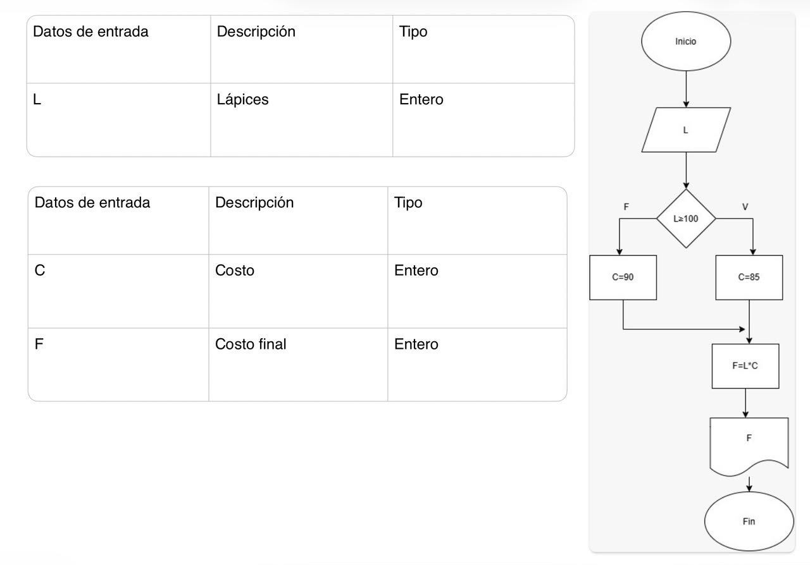
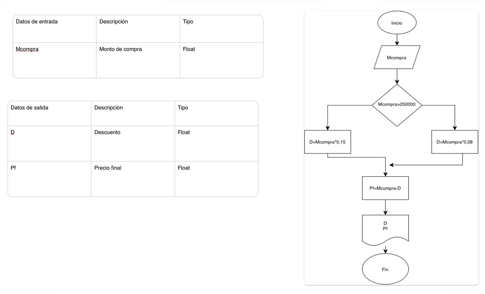
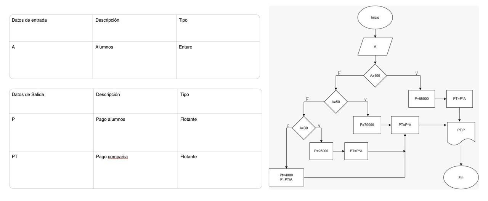

# EJERCICIOS DE CLASE DIAGRAMA DE FLUJO Y ALGORITMOS

## EJERCICIO 1
Crear algoritmo que realize el ingreso total y promedio mensual en una empresa
### Diagrama de flujo

## Ejercicio 2
Crear algoritmo para saber la edad de una persona a traves de su fecha de cumpleaños y la fecha actual

## Ejercicio 3
Un acuario necesita determinar cuántos litros o galones (eso lo decide el usuario) de agua caben en un acuario, pero solo dispone de una cinta métrica (en centímetros). Diseña un algoritmo para solucionar el problema.  

## Ejercicio 4
Realice un algoritmo para determinar cuánto se debe pagar por equis cantidad de lápices considerando que si son 1000 o más el costo es de $85 cada uno; de lo contrario, el precio es de $90. Represéntelo con el pseudocódigo y el diagrama de flujo.  

## Ejercicio 5
Un almacén de ropa tiene una promoción: por compras superiores a $250 000 se les aplicará un descuento de 15%, de caso contrario, sólo se aplicará un 8% de descuento. Realice un algoritmo para determinar el precio final que debe pagar una persona por comprar en dicho almacén y de cuánto es el descuento que obtendrá. Represéntelo mediante el pseudocódigo y el diagrama de flujo.

**Pseudocodigo**  
    Inicio  
    Leer Mcompra  
    Si Mcompra > 250000 Entonces  
         15% de descuento para compras mayores a $250.000
        descuento = Mcompra * 0.15  
    Sino  
        8% de descuento para compras iguales o menores a $250.000
        descuento=Mcompra * 0.08  
    FinSi  
    Pfinal=Mcompra - descuento  
    Escribir descuento  
    Escribir Pfinal  
    Fin  

## Ejercicio 6
El director de una escuela está organizando un viaje de estudios, y requiere determinar cuánto debe cobrar a cada alumno y cuánto debe pagar a la compañía de viajes por el servicio. La forma de cobrar es la siguiente: si son 100 alumnos o más, el costo por cada alumno es de $65.00; de 50 a 99 alumnos, el costo es de $70.00, de 30 a 49, de $95.00, y si son menos de 30, el costo de la renta del autobús es de $4000.00, sin importar el número de alumnos.  

