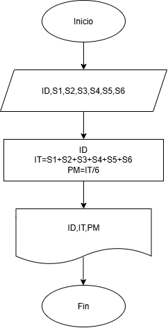
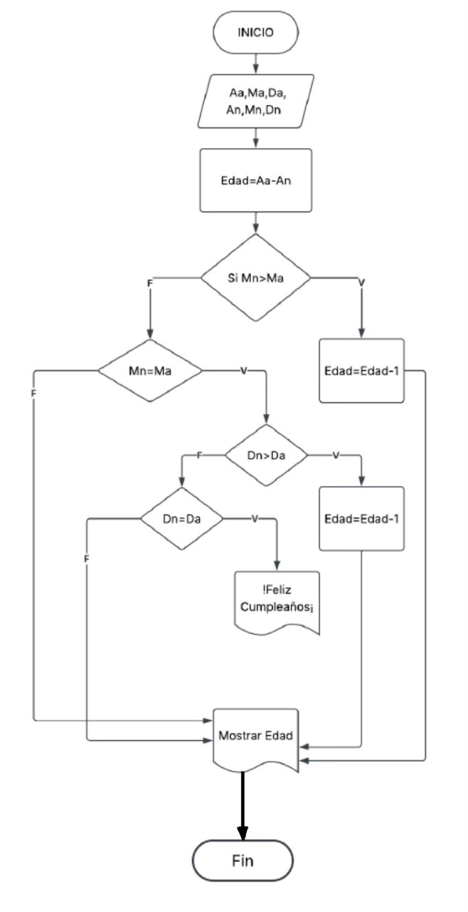

# EJERCICIOS DE CLASE DIAGRAMA DE FLUJO Y ALGORITMOS

## EJERCICIO 1
Crear algoritmo que realize el ingreso total y promedio mensual en una empresa
### Diagrama de flujo

## Ejercio 2
Crear algoritmo para saber la edad de una persona a traves de su fecha de cumpleaños y la fecha actual

