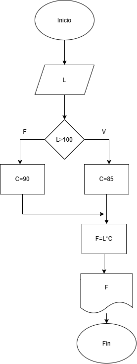
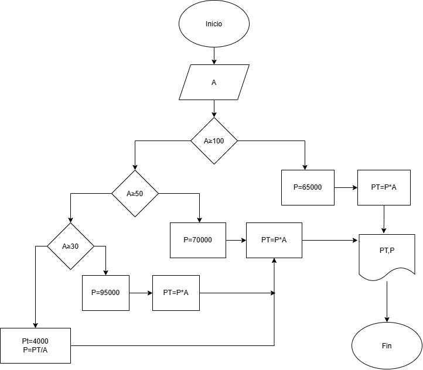

# EJERCICIOS DE CLASE DIAGRAMA DE FLUJO Y ALGORITMOS

## EJERCICIO 1
Crear algoritmo que realize el ingreso total y promedio mensual en una empresa
### Diagrama de flujo

## Ejercicio 2
Crear algoritmo para saber la edad de una persona a traves de su fecha de cumpleaños y la fecha actual

## Ejercicio 3
Realice un algoritmo para determinar cuánto se debe pagar por equis cantidad de lápices considerando que si son 1000 o más el costo es de $85 cada uno; de lo contrario, el precio es de $90. Represéntelo con el pseudocódigo y el diagrama de flujo.  

## Ejercicio 4
El director de una escuela está organizando un viaje de estudios, y requiere determinar cuánto debe cobrar a cada alumno y cuánto debe pagar a la compañía de viajes por el servicio. La forma de cobrar es la siguiente: si son 100 alumnos o más, el costo por cada alumno es de $65.00; de 50 a 99 alumnos, el costo es de $70.00, de 30 a 49, de $95.00, y si son menos de 30, el costo de la renta del autobús es de $4000.00, sin importar el número de alumnos.  

## Ejercicio 5
 **Control de temperatura del motor**

Durante una inspección de rutina, se mide la temperatura de un motor de turbina. Si la temperatura es mayor a un valor crítico, se debe indicar "Peligro: sobrecalentamiento". Si está dentro del rango seguro, indicar "Operación normal". Si es demasiado baja, indicar "Motor frío – Calentar antes de operar"  

## Ejercicio 6
Un sistema debe registrar la altitud de vuelo cada 10 minutos durante una hora y mostrar todas las mediciones al final.

**En pseudocodigo*

Inicio
cont=0
Leer nivel
Mientras nivel ≥ Max*0,1  
  cont=cont+1  
  Leer nivel  
Fin mientras  
Mostrar "Tiempo transmitido" cont  
Fin  

