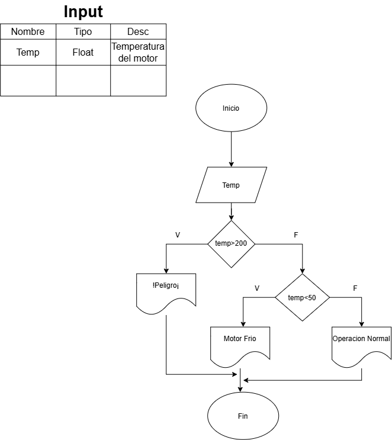

# Taller algoritmos 🚀

### **Ejercicios con condicionales**

1. **Verificación de peso de despegue**
    
    En una pista de pruebas de aeronaves, el sistema debe verificar si el peso total de la aeronave, incluyendo combustible y carga, supera el límite máximo permitido para el despegue. Dependiendo del resultado, el sistema deberá indicar si la aeronave está lista para despegar o si debe reducir carga o combustible.  
   **Pseudocodigo**  
   Inicio  
    Leer peso_total, peso_maximo  
    Si peso_total > peso_maximo Entonces  
        Mostrar "No está lista para despegar: reducir carga o combustible"  
    Sino  
        Mostrar "Aeronave lista para despegar"  
    Fin Si  
Fin  
 

2. **Control de temperatura del motor**
    
    Durante una inspección de rutina, se mide la temperatura de un motor de turbina. Si la temperatura es mayor a un valor crítico, se debe indicar "Peligro: sobrecalentamiento". Si está dentro del rango seguro, indicar "Operación normal". Si es demasiado baja, indicar "Motor frío – Calentar antes de operar".  
      
**Pseudocodigo**  
Inicio  
    Leer temperatura, temp_critica, temp_min_segura  
    Si temperatura > temp_critica Entonces  
        Mostrar "Peligro: sobrecalentamiento"  
    Sino Si temperatura < temp_min_segura Entonces  
        Mostrar "Motor frío - Calentar antes de operar"  
    Sino  
        Mostrar "Operación normal"  
    Fin Si  
Fin  

---

### **Ejercicios con bucles**

1. **Registro de altitudes de vuelo**
    
    Un sistema debe registrar la altitud de vuelo cada 10 minutos durante una hora y mostrar todas las mediciones al final.  
    **Pseudocodigo**  

Inicio  
cont=0  
Leer nivel  
Mientras nivel ≥ Max*0,1  
  cont=cont+1  
  Leer nivel  
Fin mientras  
Mostrar "Tiempo transmitido" cont  
Fin  

    
2. **Control de combustible en pruebas**
    
    Durante un ensayo en banco de un motor a reacción, se mide el nivel de combustible cada minuto y se detiene el registro cuando el combustible baja del 10%. Mostrar el tiempo total de operación antes de llegar a ese punto.  
**Pseudocodigo**  

Inicio  
    tiempo <- 0  
    Leer nivel_combustible  
    Mientras nivel_combustible >= 10 Hacer  
        tiempo <- tiempo + 1  
        Leer nivel_combustible  
    Fin Mientras  
    Mostrar "Tiempo total de operación: ", tiempo, " minutos"  
Fin  

---

### **Ejercicios con bucle y condicionales**

1. **Detección de turbulencia en trayecto**
    
    Un sensor mide la aceleración vertical de la aeronave en intervalos de un segundo durante un trayecto de 2 minutos. Si el valor medido supera un umbral, indicar que se ha detectado turbulencia en ese instante. Al final, mostrar cuántas turbulencias se detectaron.
**Pseudocodigo**  

Inicio  
    contador_turbulencias <- 0  
    Para segundo desde 1 hasta 120 Hacer  
        Leer aceleracion  
        Si aceleracion > umbral Entonces  
            Mostrar "Turbulencia detectada en el segundo ", segundo  
            contador_turbulencias <- contador_turbulencias + 1  
        Fin Si  
    Fin Para  
    Mostrar "Total de turbulencias detectadas: ", contador_turbulencias  
Fin  

2. **Control de temperatura en cabina**
    
    Un sistema mide cada 5 minutos la temperatura en cabina durante una hora. Si en algún momento se detecta una temperatura mayor a 27°C o menor a 18°C, debe indicar que se active el sistema de climatización.  
    **Pseudocodigo**  
Inicio  
cont=0  
Leer temp  
Mientras cont<12  
  Si temp>27 o temp<12  
  Mostrar "Activar climatizacion"  
Fin Si  
cont=con + 1  
Fin Mientras  
Fin  

3. **Simulación de conteo de pasajeros**
    
    Durante el abordaje, un sistema cuenta a los pasajeros que ingresan. Si el número total supera la capacidad máxima, el sistema debe detener el conteo y mostrar un mensaje de alerta.  
**Pseudocodigo**  
Inicio  
    Leer capacidad_maxima  
    contador <- 0  
    bandera <- Verdadero  
    Mientras bandera Hacer  
        Leer nuevo_pasajero  
        Si nuevo_pasajero = 1 Entonces  
            contador <- contador + 1  
            Si contador > capacidad_maxima Entonces  
                Mostrar "Alerta: capacidad máxima superada"  
                bandera <- Falso  
            Fin Si  
        Sino  
            bandera <- Falso  
        Fin Si  
    Fin Mientras  
    Mostrar "Total de pasajeros contados: ", contador  
Fin  

---

### **Ejercicios de mayor complejidad**

1. **Planificación de misión satelital**
    
    Desarrollar un algoritmo que reciba datos de consumo de energía por hora de un satélite durante un día completo. Si en cualquier hora el consumo excede un límite crítico, debe registrarse como una alerta. Al final, mostrar el consumo total y el número de alertas generadas.

**Pseudocodigo**  
Inicio  
    Leer limite_critico  
    consumo_total <- 0  
    alertas <- 0  
    Para hora desde 1 hasta 24 Hacer  
        Leer consumo_hora  
        consumo_total <- consumo_total + consumo_hora  
        Si consumo_hora > limite_critico Entonces  
            alertas <- alertas + 1  
            Mostrar "Alerta en la hora ", hora  
        Fin Si  
    Fin Para  
    Mostrar "Consumo total: ", consumo_total  
    Mostrar "Número de alertas: ", alertas  
Fin  

2. **Simulación de carga y balanceo de aeronave**
    
    Una aeronave tiene varias bodegas de carga. El sistema debe permitir ingresar el peso cargado en cada bodega y verificar que:  
    
    - El peso total no exceda el máximo permitido. 
    - Ninguna bodega individual supere su límite.
        
        Mostrar mensajes de advertencia si alguna condición no se cumple.
   
**Pseudocodigo**  
Inicio  
    Leer numero_bodegas, peso_maximo_total, limite_por_bodega  
    peso_total <- 0  
    Para i desde 1 hasta numero_bodegas Hacer  
        Leer peso_bodega  
        peso_total <- peso_total + peso_bodega  
        Si peso_bodega > limite_por_bodega Entonces  
            Mostrar "Advertencia: bodega ", i, " excede su límite individual"  
        Fin Si  
    Fin Para  
    Si peso_total > peso_maximo_total Entonces  
        Mostrar "Advertencia: peso total excede el máximo permitido"  
    Sino  
        Mostrar "Carga dentro de los límites permitidos"  
    Fin Si  
Fin  

3. **Monitoreo de aproximación a pista**
    
    Durante la aproximación, un sistema recibe datos de altitud y velocidad cada 5 segundos hasta el aterrizaje. Si la velocidad excede el valor máximo seguro o la altitud no desciende adecuadamente, debe indicarse un mensaje de corrección de maniobra. Mostrar un resumen final de todos los avisos emitidos.

**Pseudocodigo**  
Inicio  
    Leer velocidad_maxima_segura  
    avisos <- 0  
    aterrizado <- Falso  
    Mientras NO aterrizado Hacer  
        Leer altitud, velocidad, descenso_adecuado  
        Si velocidad > velocidad_maxima_segura Entonces  
            Mostrar "Corrección de maniobra: reducir velocidad"  
            avisos <- avisos + 1  
        Fin Si  
        Si NO descenso_adecuado Entonces  
            Mostrar "Corrección de maniobra: ajustar descenso"  
            avisos <- avisos + 1  
        Fin Si  
        Si altitud <= 0 Entonces  
            aterrizado <- Verdadero  
        Fin Si  
        Esperar 5 segundos  
    Fin Mientras  
    Mostrar "Total de avisos emitidos: ", avisos  
Fin  
